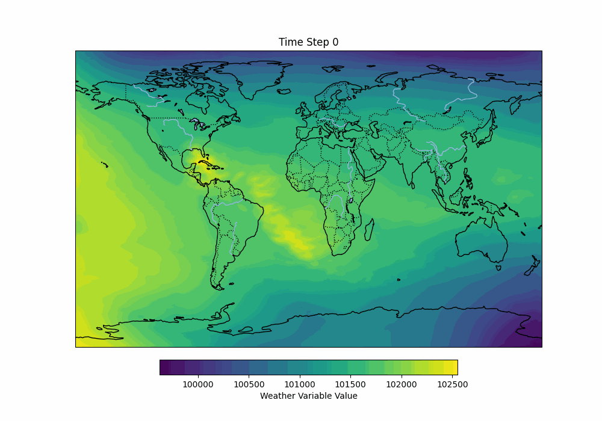
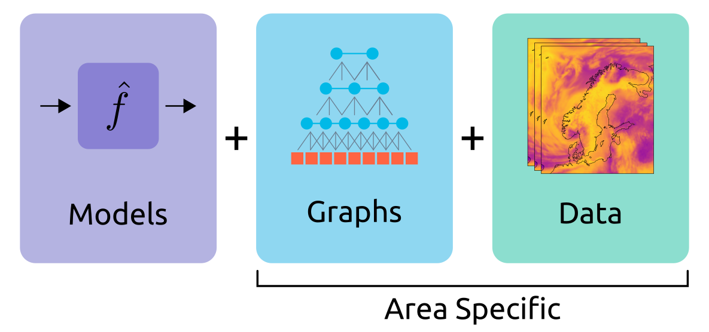
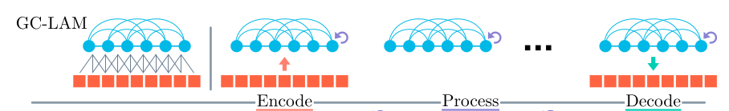
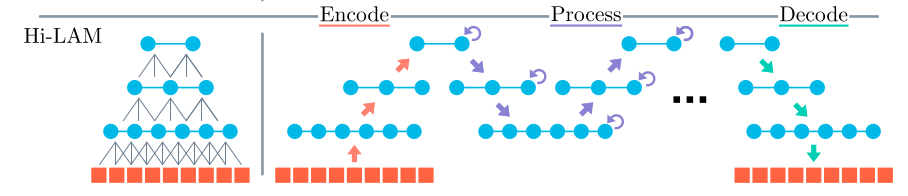

# Modularity
The Neural-LAM code is designed to modularize the different components involved in training and evaluating neural weather prediction models.
Models, graphs and data are stored separately and it should be possible to swap out individual components.
Still, some restrictions are inevitable:

* The graph used has to be compatible with what the model expects. E.g. a hierarchical model requires a hierarchical graph.
* The graph and data are specific to the limited area under consideration. This is of course true for the data, but also the graph should be created with the exact geometry of the area in mind.

<p align="middle">
  
</p>

## GC-LAM (GraphCast Limited Area Model): 
GC-LAM adapts the GraphCast model for limited area weather forecasting. It uses a multi-scale mesh graph, where weather data is encoded from grid nodes, processed through Graph Neural Networks (GNNs) on a mesh, and decoded back to grid nodes for predictions. However, GC-LAM suffers from visual artifacts (circular patterns) at nodes with many neighbors, affecting prediction quality.

<div align="center">
    
</div>


To train GC-LAM use
```
python -m neural_lam.train_model --model graph_lam --graph multiscale ...
```

To test use
```
python -m neural_lam.train_model --eval val ( to test on val dataset) and --eval test ( to test on test dataset )
```
## Hi-LAM (Hierarchical Limited Area Model): 
Hi-LAM improves on GC-LAM by introducing a hierarchical mesh graph with multiple levels of resolution. It processes weather data across these levels, enabling better management of both local and large-scale information. This reduces the artifacts seen in GC-LAM and improves forecast accuracy. The model uses separate GNN layers to handle intra- and inter-level data flow, ensuring smoother predictions.

<div align="center">
    
</div>

To train Hi-LAM use
```
python -m neural_lam.train_model --model hi_lam --graph hierarchical ...
```

## 1L-LAM (Single-Level Limited Area Model): 
This model is a simpler version that uses a single-resolution mesh without multi-scale edges. As a result, it performs significantly worse than GC-LAM and Hi-LAM, exhibiting poor accuracy and more severe visual artifacts. It highlights the importance of multi-scale structures in effective weather prediction.

To train 1L-LAM use
```
python -m neural_lam.train_model --model graph_lam --graph 1level ...
```
